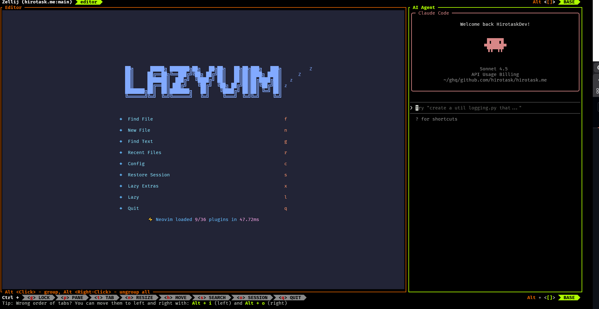

# dotfiles

## Installation

1. Clone this repository
```
git clone --recursive https://github.com/hirotask/dotfiles.git
cd dotfiles
```

2. Install
```
./install.sh
```

3. (If you want to install extra-packages, run)
```
./script/dotinstaller/dotinstall.sh install-extra
```

4. (If you want to use zsh, run)
```
exec zsh
```

5. Enjoy!

## How to start programming

If you start programming, run:

```bash
ide
```

You can choose the project and start programming using the layout below:



## Directory structure

The directory structure is based on https://github.com/yutkat/dotfiles .
